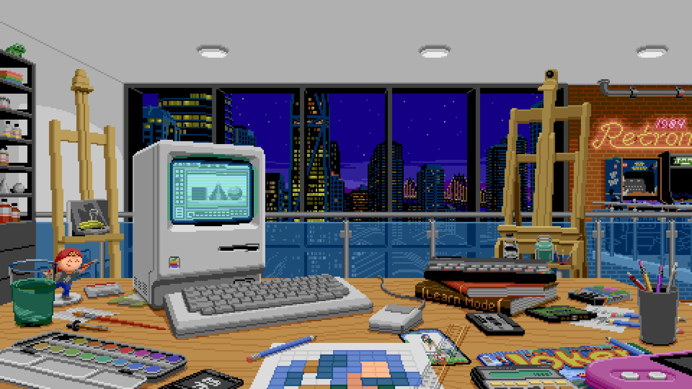

<!-- desktop version -->
<div class="desktop-only">

```txt 
◤━━━━━━━━━━━━━━━━━━━━━━━━━━━━━━━━━━━━━━━━━━━━━━━━━━━━━━━━━━━━━━━━━━━━━━━━━━━━━━━━━━━━━━━━━━━━━◥

▌                           <-*-🖌️-*-🖱️- Hi, I'm Félise -🖱️-*-🖌️-*->                          ▐

◣━━━━━━━━━━━━━━━━━━━━━━━━━━━━━━━━━━━━━━━━━━━━━━━━━━━━━━━━━━━━━━━━━━━━━━━━━━━━━━━━━━━━━━━━━━━━━◢
```

<div align="center">
<br>


</div>


### 🧰 in my toolbox :


 




</div>

<!-- Version Mobile -->
<div class="mobile-only">

## Hi, I'm Félise -🖱️-*-🖌️-*->

<div align="center">
<br>


</div>

### 🧰 in my toolbox :


 


</div>

<!-- CSS / responsiveness -->
<style>
@media (max-width: 768px) {
  .desktop-only { display: none !important; }
  .mobile-only { display: block !important; }
}

@media (min-width: 769px) {
  .desktop-only { display: block !important; }
  .mobile-only { display: none !important; }
}
</style>